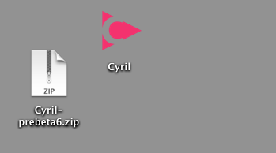
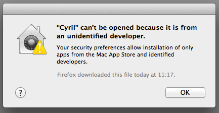
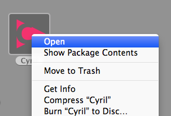
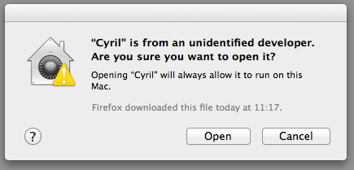

## Beta

  Prebuilt binaries are available to download for OSX only.
  <a href="https://github.com/darrenmothersele/cyril/releases">
    Downloads moved to GitHub
  </a>

Please feel free to submit any bugs, feature requests, ideas and feedback
via the <a href="https://github.com/darrenmothersele/cyril/issues">GitHub
issue queue</a>.

  <a href="https://github.com/darrenmothersele/cyril/releases">cyril-beta3.zip</a>

<ul>
  <li><strong>Update 7th May 2014</strong></li>
  <li>Added separate data folder for code and sprites.</li>
  <li>Added img command for drawing sprites</li>
</ul>

<h3>older versions...</h3>

  <a href="https://github.com/darrenmothersele/cyril/releases">cyril-beta2.zip</a>

<ul>
  <li><strong>Update 25th Nov 2013</strong></li>
  <li>Built against new version of ofxEditor which fixes performance issues
    when a large text buffer is loaded into the editor.</li>
</ul>

  <a href="https://github.com/darrenmothersele/cyril/releases">cyril-beta1.zip</a>

<ul>
  <li><strong>Update 20th Nov 2013</strong></li>
  <li>Replaced ofxGLEditor with ofxEditor</li>
  <li>Allows multiple editor text buffers to run at the same time.</li>
  <li>Added indicator to show status of text buffers</li>
  <li>General bug fixes and optimisations</li>
</ul>

<h2>Open source</h2>

<strong>Update:</strong> The full source code for Cyril is now available on
  GitHub:

<a href="https://github.com/darrenmothersele/cyril">https://github.com/darrenmothersele/cyril</a>

<ul><li>
  <a href="https://github.com/darrenmothersele/ofxEditor">ofxEditor</a> - a text
  editor for live coding with openFrameworks. Based a little on ofxGLEditor that
  was used in the initial versions of Cyril, but with more emphasis on using the
  openFrameworks API.
</li>
<li><a href="https://github.com/darrenmothersele/ofxBeat">ofxBeat</a> - a
simple beat detection library with 32 bands of FFT and separate detection
of kick, snare and hihat. A fast but basic aproach to beat detection.</li>
</ul>

## Running...

I don't have a Mac developer account yet, so the application isn't
signed. This means you wont be able to open it straight away. Here's
how to run the app...

### Download and extract...

You get the Cyril app downloaded. If you double click to run this
you would see this warning...

But you can't run it! Instead command click and select open...

You get a different warning this time, but select open and Cyril will start.

Press `COMMAND` + `f` to get into full screen mode. Press `ESC` to exit.
